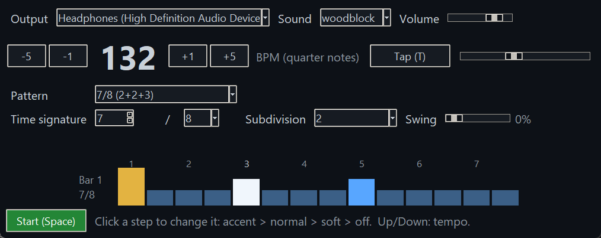
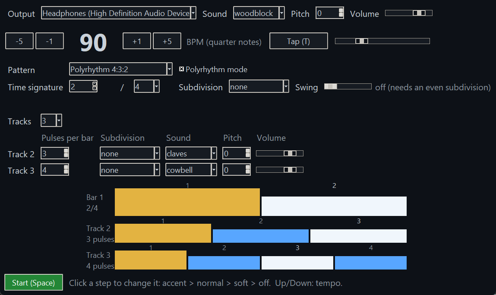
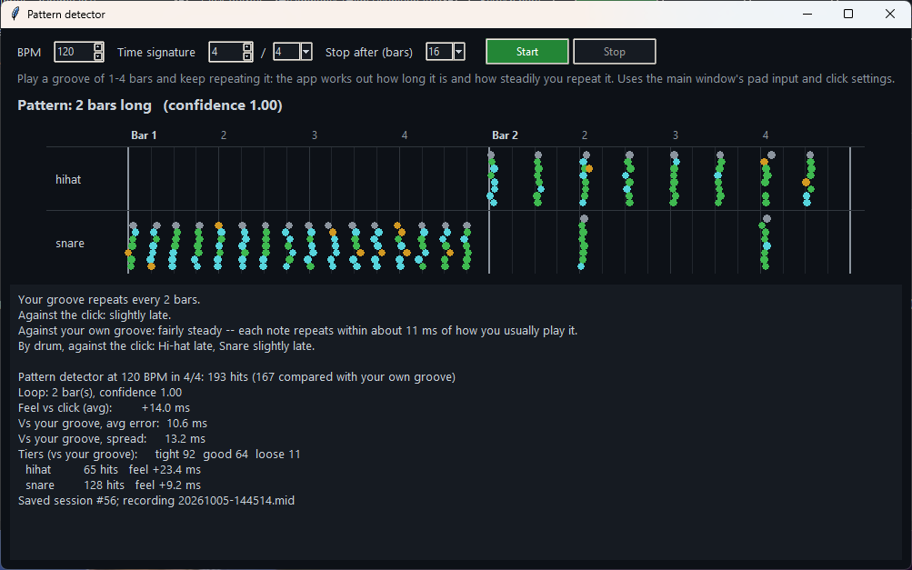
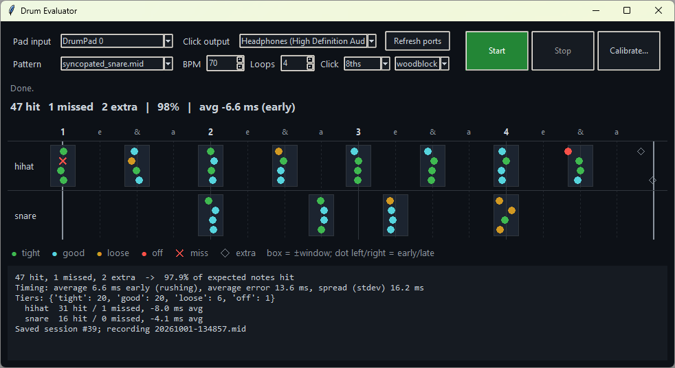
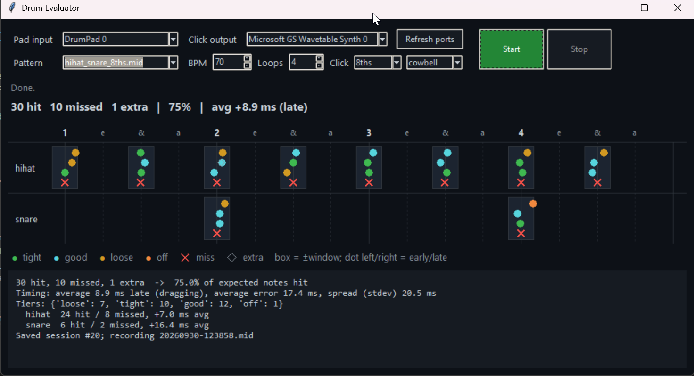

# Changelog

Notable changes to Drum Evaluator, newest first.

## 2026-10-05

- **Pattern detector.** Play a groove of 1 to 4 bars to the click, no
  pattern file needed, and keep repeating it. The app works out how many
  bars it is, shows every hit on a grid of the pattern as you play, and
  sums up how steady you were against the click and against your own
  groove, drum by drum. Open it with the new Pattern detector... button.
- **The metronome starts faster:** about 0.1 s from Start to the first
  click, down from about 0.35 s.

- **Standalone metronome.** A full metronome that works on its own, no
  kit needed. Set the tempo with buttons, a slider, the arrow keys or tap
  tempo. Use any time signature, add subdivisions from 8ths to
  quintuplets and sextuplets, and dial in swing from 0% (straight) to
  100%.
- **Built-in click patterns.** 2/4 through 13/8 (odd meters ready-grouped,
  e.g. 7/8 as 2+2+3 or 3+2+2), swing 8ths and 16ths,
  son, rumba and bossa nova clave, and polyrhythms.
- **Polyrhythm mode.** Up to four click tracks at once, each spreading
  its own number of pulses over the bar (3 against 2, 5 against 4, or
  4:3:2 on three tracks), with its own sound, pitch and volume so you can
  hear each rhythm. Turn the mode off to go back to the first track.
- **Pitch for every click sound.** Shift any click up or down by up to an
  octave, so the four sounds become many.
- **Open the metronome from the main window**, with the new
  Metronome... button.
- **Edit the click step by step.** Click any step to make it an accent,
  normal, soft or silent. Your accents stay when you change the
  subdivision. Tempo and step changes are heard right away;
  a new time signature starts at the next bar line.
- **Scoring checked against research.** The timing grades and the words
  in the summary were compared with published studies of drummers'
  timing. The current thresholds hold up: for example, "very steady"
  matches the consistency of professional drummers. The comparison also
  found two improvements now on the roadmap: judging each drum's
  steadiness against its own feel (pros naturally play kick and snare a
  touch ahead of the hi-hat), and fewer false misses at fast tempos.
- **Plans for Mac, iPhone/iPad and Android.** The app is being organized
  so one shared scoring engine runs on all four platforms, so the same
  playing gets the same score everywhere.
- **Fixed: the click no longer takes over your sound output.** Music,
  lesson videos and screen recorders (like OBS) now work while it plays.
  If you've calibrated before, calibrate once more: the app reminds you,
  because the sound now takes a slightly different route to your
  speakers.

## 2026-10-01

- **Dynamics feedback.** How evenly each note of the groove is played
  across loops, compared only with its own repeats (the snare on 2 with
  other snares on 2), and whether ghost notes stay quiet and accents stand
  out. Shown live under each note on the timeline.
- **Works with any velocity curve.** Pads offer different curves for
  turning hit strength into volume. Dynamics are judged in a way that gives
  the same answer whichever curve your pad uses.
- **Plain-language summary.** Results now read like a teacher's notes:
  how it went, timing in words, uneven notes by where they fall in the bar
  ("snare ghost note on 2-a"), and one "Try next" suggestion. The detailed
  numbers are behind a **Show details** button.
- **Volume feedback per drum.** A checkbox on each drum's row turns its
  volume feedback on or off. Cymbals start off, since their volume rarely
  matters and would clutter the feedback.
- **New click engine.** The metronome now plays directly through the sound
  card, timed to the exact sample. The click's own delay is compensated
  automatically, so calibration only has to measure the player and the pad.
- **Clearer calibration.** Calibration only sounds the clicks you're meant
  to hit. Extra in-between clicks made it easy to follow the wrong ones.
- Timing that's *off* now shows in red in the timeline.
- Fixes in free-play loop detection and in re-scoring saved recordings.

## 2026-09-30

- **Desktop app.** Pick a pattern, tempo and loops, then watch each hit
  land on a live timeline, with a summary at the end. A pattern preview
  shows when you select one.
- **Calibration in the app**: hit any one pad along with the click. Several
  takes are combined so one off take can't skew the result.
- **First successful live run**: every note of a syncopated groove with
  ghost notes was detected and scored on a real drum pad.
- Play-along sessions with live scoring, a count-in, and an adjustable
  click (beats, 8ths, triplets, 16ths).
